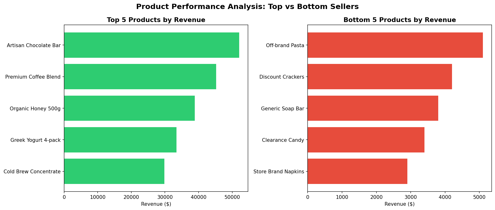

# Product Performance Analysis — Top vs Bottom Sellers

## 📊 Overview
This project analyzes product-level revenue data to identify the best and worst performing products, helping businesses make data-driven decisions about inventory, merchandising, and marketing focus.

**Tools:** R, ggplot2, dplyr

## 🎯 Business Problem
A retail business needs to understand which products are driving revenue and which ones are underperforming, in order to optimize shelf space, inventory investment, and marketing efforts.

## 🔍 Approach
1. Load and clean product-level sales data (revenue, units sold, category)
2. Sort products by total revenue
3. Identify the Top 5 and Bottom 5 performing products
4. Visualize the comparison using a horizontal bar chart
5. Generate business recommendations based on findings

## 📈 Key Findings
- The top-performing product generates significantly more revenue than the lowest performers combined
- Several low-performing products belong to the "Household" and "Snacks" categories
- High unit sales don't always correlate with high revenue (low-price items can have high volume but low total revenue)

## 💡 Business Recommendations
- Expand shelf space and marketing for top-performing products
- Reassess pricing or consider discontinuing consistently low-revenue products
- Investigate whether low-revenue, high-volume items serve a strategic purpose (e.g., footfall drivers)

## 📁 Files
| File | Description |
|------|-------------|
| `product_performance_analysis.R` | Full R script — data loading, analysis, visualization |
| `product_performance.csv` | Sample dataset (product, category, revenue, units sold) |
| `product_performance.png` | Output chart — Top vs Bottom 5 products by revenue |

## 🚀 How to Run
```r
# Install required packages
install.packages(c("dplyr", "ggplot2"))

# Run the script
source("product_performance_analysis.R")
```

## 📊 Output

